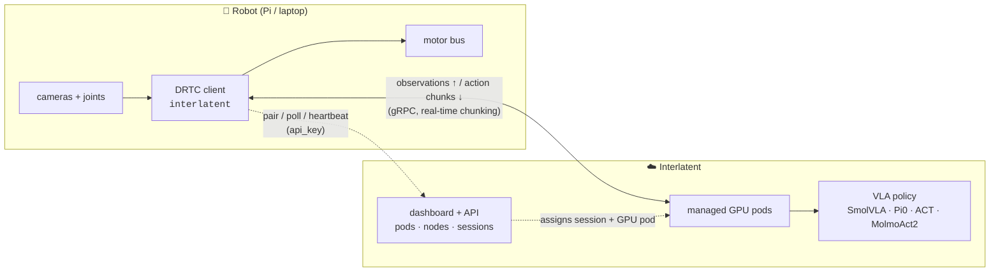

<div align="center">


### Run any VLA policy on your robot — open source.

The open-source robot-side stack for SmolVLA, Pi0, ACT, MolmoAct2 and friends: stream
observations to managed cloud GPUs, drive a real arm in real time, and collect LeRobot datasets.

[](https://pypi.org/project/interlatent/)
[](LICENSE)
[](https://www.python.org/)
[](https://github.com/huggingface/lerobot)
[](https://github.com/interlatent/interlatent)

[Quickstart](#-quickstart) · [How it works](#-how-it-works) · [Examples](examples/) · [Docs](docs/) · [Cloud](#-open-source-vs-interlatent-cloud)

</div>

---

Modern robot policies (VLAs) are too big to run on the robot. Interlatent splits the problem:
**managed cloud GPUs** run the policy, and a **lightweight open-source client** on the robot
streams observations up and actions back with real-time chunking, so the arm never stutters
while the model thinks. You bring the robot; the dashboard brings the compute.

- 🚀 **Run any LeRobot policy** — SmolVLA, Pi0/Pi0.5, ACT, Diffusion Policy, VQ-BeT, TDMPC, MolmoAct2 — on managed warm GPUs, no cold starts
- 🦾 **Drive real hardware** (SO-101, Koch, ALOHA, anything LeRobot supports) over LAN, Tailscale, or the internet
- ⚡ **Real-time action chunking (DRTC)** — pipelined inference, latency estimation, and chunk merging keep control smooth at 30 Hz even with multi-second model latency
- 🛰️ **Robot node daemon** — pair a Pi (or any always-on machine) to your account; it converges to whatever inference session the dashboard assigns
- 🖥️ **CLI utility** — list your pods and nodes and start/stop inference sessions from the terminal (`interlatent pods ls`, `interlatent session start …`)
- 📦 **Collect LeRobot v3.0 datasets** locally — your data, your disk, no account required

The robot-side stack is Apache-2.0; inference runs on [Interlatent](https://interlatent.com).

## ⚡ Quickstart

```bash
pip install interlatent
```

### 1. Get an API key

Sign in at [interlatent.com](https://interlatent.com) and create an API key (`ilat_…`).
Export it so the SDK and CLI can find it:

```bash
export INTERLATENT_API_KEY=ilat_...
```

### 2. Drive a policy from your robot

```python
from interlatent.inference.integration import connect_drtc

client = connect_drtc(
    environment="my-arm",
    policy_uri="lerobot/smolvla_base",
    api_key="ilat_...",                # resolves your account + attached GPU pod
    task="pick up the red cube",
    fps=30,
)
while running:
    action = client.step(observation_npz_bytes, codec="npz")
    if action is not None:
        robot.apply(action)
client.close()
```

See [`examples/03_run_on_so101.py`](examples/03_run_on_so101.py) for a complete SO-101 loop,
or [`examples/06_connect_hosted.py`](examples/06_connect_hosted.py) for the minimal connect.

### 3. Or run a robot node + CLI

```bash
interlatent-node pair --name my-arm --api-key ilat_...   # register the robot once
interlatent-node run  --robot so101 --port /dev/ttyACM0  # converge to assigned sessions

interlatent pods ls          # GPU pods available to your account
interlatent nodes ls         # robot nodes paired to your account
interlatent session start --node my-arm --pod a100-0 --policy lerobot/smolvla_base
```

### Collect datasets with no account

```bash
python examples/05_collect_dataset.py   # builds a LeRobot v3.0 dataset locally
```

## 🧠 How it works



The client and the GPU pod speak **DRTC** (Distributed Real-Time Chunking): the robot streams
observations continuously, the pod returns overlapping *action chunks*, and the client merges
them with last-writer-wins semantics while estimating network vs. compute latency. The result
is smooth high-rate control on top of slow, big models. Read more in
[docs/concepts.md](docs/concepts.md).

### What's in the box

| Package | PyPI | What it does |
|---|---|---|
| [`packages/sdk`](packages/sdk) | `interlatent` | Robot-side stack: DRTC inference client, robot node daemon, dashboard CLI (`interlatent`), LeRobot integration, local dataset collection |
| [`proto/`](proto) | — | The gRPC wire contract shared by the client and the hosted cloud |

## ☁️ Open source vs. Interlatent Cloud

The robot-side stack is open source and yours to run. Inference itself runs on managed GPUs
through the [Interlatent dashboard](https://interlatent.com) — so you never operate GPUs,
warm pools, or storage.

| Capability | Open source | [Interlatent](https://interlatent.com) |
|---|:---:|:---:|
| Robot node daemon + DRTC client | ✅ | ✅ |
| Run a VLA policy on your robot | — (needs a GPU pod) | ✅ managed warm GPUs, no cold starts |
| Collect LeRobot datasets | ✅ local files | ✅ + managed storage & versioning |
| CLI for pods / nodes / sessions | ✅ | ✅ + full dashboard |
| Dataset hosting / sharing | DIY (HF / your S3) | ✅ managed, shareable links |
| **Reward labeling (Robometer)** | ❌ | ✅ dense rewards & value models |
| Auto policy analysis & reports | ❌ | ✅ |
| Multi-robot / team management | ❌ | ✅ |
| GPU autoscaling & warm pools | ❌ | ✅ |
| Support / SLA | community | ✅ |

## 📚 Examples

| Example | Hardware needed |
|---|---|
| [`03_run_on_so101.py`](examples/03_run_on_so101.py) — drive an SO-101 arm against a cloud pod | SO-101 (or none — synthesizes obs) |
| [`05_collect_dataset.py`](examples/05_collect_dataset.py) — collect a LeRobot v3.0 dataset locally | none (gym env) |
| [`06_connect_hosted.py`](examples/06_connect_hosted.py) — the minimal cloud connect | none |

## 📖 Documentation

- [Getting started](docs/getting-started.md) — robot → first rollout
- [Concepts](docs/concepts.md) — DRTC, sessions, chunks, datasets, the node
- [Supported robots & policies](docs/robots-and-policies.md)
- [Going to cloud](docs/going-to-cloud.md) — what you get, honestly
- [Architecture](ARCHITECTURE.md) — for contributors

## 🤝 Contributing

We'd love your help — especially **adding robots**, which is how this project gets breadth.
Start with [CONTRIBUTING.md](CONTRIBUTING.md) and the
[`good first issue`](https://github.com/interlatent/interlatent/labels/good%20first%20issue) label.

This project uses the [Developer Certificate of Origin](https://developercertificate.org/)
(`git commit -s`). Questions, demos, robot pics: team@interlatent.com.

## 📄 License

[Apache-2.0](LICENSE) © Interlatent Contributors.

"Interlatent Cloud" and the hosted service at interlatent.com are operated separately from
this open-source project.
