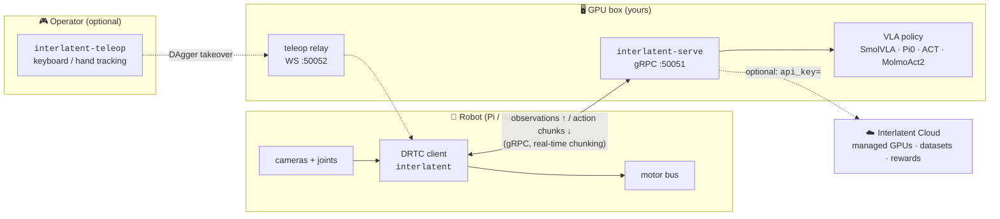

<div align="center">


### Run any VLA policy on your robot — open source.

Self-host low-latency inference for SmolVLA, Pi0, ACT, MolmoAct2 and friends on your own GPU,
drive a real arm over the network, teleoperate, and collect LeRobot datasets.

[](https://pypi.org/project/interlatent/)
[](LICENSE)
[](https://www.python.org/)
[](https://github.com/huggingface/lerobot)
[](https://github.com/interlatent/interlatent)

[Quickstart](#-quickstart) · [How it works](#-how-it-works) · [Examples](examples/) · [Self-hosting](docs/self-hosting.md) · [Docs](docs/) · [Cloud](#-open-source-vs-interlatent-cloud)

<!-- TODO before public launch: record a real SO-101 arm running SmolVLA via
     `interlatent-serve` and drop it here as assets/demo.gif — this is the
     single highest-leverage asset in the repo. -->

</div>

---

Modern robot policies (VLAs) are too big to run on the robot. Interlatent splits the problem:
a **GPU server** runs the policy anywhere — your workstation, a lab box, a rented GPU — and a
**lightweight client** on the robot streams observations up and actions back with real-time
chunking, so the arm never stutters while the model thinks.

- 🚀 **Serve any LeRobot policy** on your own GPU with one command — SmolVLA, Pi0/Pi0.5, ACT, Diffusion Policy, VQ-BeT, TDMPC, MolmoAct2
- 🦾 **Drive real hardware** (SO-101, Koch, ALOHA, anything LeRobot supports) over LAN, Tailscale, or the internet
- ⚡ **Real-time action chunking (DRTC)** — pipelined inference, latency estimation, and chunk merging keep control smooth at 30 Hz even with multi-second model latency
- 🎮 **Teleoperate** with your keyboard or MediaPipe hand tracking, including DAgger-style takeover during policy rollouts
- 🛰️ **Run robot nodes with no dashboard** — a local coordinator (`interlatent up`) assigns sessions to your robots and records episodes to a local dir or S3, fully self-hosted
- 📦 **Collect LeRobot v3.0 datasets** locally — your data, your disk, no account required
- ☁️ **One-line cloud upgrade** — the same code runs against [Interlatent Cloud](https://interlatent.com) for managed warm GPUs, hosted datasets, and reward labeling

Everything in this repo works fully offline with zero account. Apache-2.0.

## ⚡ Quickstart

### Try it in 60 seconds (no robot, no GPU)

```bash
git clone https://github.com/interlatent/interlatent && cd interlatent
pip install interlatent interlatent-server
python examples/01_loopback_no_hardware.py   # spawns a local test server, runs the full robot loop
```

The example starts `interlatent-serve` with the built-in test backend and drives it the
exact way a robot would — observations up, action chunks back, one action per tick.

### Serve a real policy on your GPU

```bash
pip install 'interlatent-server[lerobot]'
interlatent-serve --policy lerobot/smolvla_base   # pre-warms torch.compile, then listens on :50051
```

### Drive it from your robot

```python
from interlatent.inference.integration import connect_drtc

client = connect_drtc(
    environment="my-arm",
    policy_uri="lerobot/smolvla_base",
    server_address="gpu-box:50051",   # your self-hosted server — no API key needed
    task="pick up the red cube",
    fps=30,
)
while running:
    action = client.step(observation_npz_bytes, codec="npz")
    if action is not None:
        robot.apply(action)
client.close()
```

See [`examples/03_run_on_so101.py`](examples/03_run_on_so101.py) for a complete SO-101 loop,
or use the GPU [Docker image](docker/) to deploy the server on RunPod / Lambda / Vast / bare metal.

## 🧠 How it works



The client and server speak **DRTC** (Distributed Real-Time Chunking): the robot streams
observations continuously, the server returns overlapping *action chunks*, and the client
merges them with last-writer-wins semantics while estimating network vs. compute latency.
The result is smooth high-rate control on top of slow, big models. Read more in
[docs/concepts.md](docs/concepts.md).

### What's in the box

| Package | PyPI | What it does |
|---|---|---|
| [`packages/sdk`](packages/sdk) | `interlatent` | Robot-side client: DRTC inference client, robot node daemon, local coordinator CLI (`interlatent up`), LeRobot integration, local dataset collection |
| [`packages/server`](packages/server) | `interlatent-server` | Self-hosted gRPC inference server: policy backends, action chunk scheduling, torch.compile warm-up, episode recording, teleop relay |
| [`packages/teleop`](packages/teleop) | `interlatent-teleop` | Direct laptop ↔ Pi teleoperation: keyboard + MediaPipe hand tracking, 50 Hz control loop with safety gate |
| [`proto/`](proto) | — | The gRPC wire contract shared by client, server, and the hosted cloud |
| [`docker/`](docker) | — | CUDA Docker image for the inference server (RunPod, Lambda, Vast, bare metal) |
| [`teleop-proxy/`](teleop-proxy) | — | Tiny WebSocket relay for browser teleop across restrictive networks |

## ☁️ Open source vs. Interlatent Cloud

Everything you need to run robots is open source and works offline. The hosted platform
exists so you don't have to operate GPUs and storage — and for the parts that need our
training infrastructure.

| Capability | OSS (self-host, free) | [Interlatent Cloud](https://interlatent.com) |
|---|:---:|:---:|
| Run a VLA policy on your robot | ✅ your GPU | ✅ managed warm GPUs, no cold starts |
| Self-host inference server | ✅ | — (we run it) |
| Collect LeRobot datasets | ✅ local files | ✅ + managed storage & versioning |
| Teleop (keyboard / hand tracking) | ✅ | ✅ + browser teleop relay |
| Local episode export | ✅ basic | ✅ full dashboard |
| Dataset hosting / sharing | DIY (HF / your S3) | ✅ managed, shareable links |
| **Reward labeling (Robometer)** | ❌ | ✅ dense rewards & value models |
| Auto policy analysis & reports | ❌ | ✅ |
| Multi-robot / team management | ❌ | ✅ |
| GPU autoscaling & warm pools | ❌ | ✅ |
| Support / SLA | community | ✅ |

Going hosted is one argument, not a rewrite:

```diff
 client = connect_drtc(
     environment="my-arm",
     policy_uri="lerobot/smolvla_base",
-    server_address="gpu-box:50051",
+    api_key="ilat_...",        # that's it — managed GPUs, recording, datasets
     task="pick up the red cube",
 )
```

## 📚 Examples

| Example | Hardware needed |
|---|---|
| [`01_loopback_no_hardware.py`](examples/01_loopback_no_hardware.py) — full client↔server loop with the test backend | none |
| [`02_serve_policy.md`](examples/02_serve_policy.md) — serve SmolVLA / Pi0 / MolmoAct2 on your GPU | a GPU |
| [`03_run_on_so101.py`](examples/03_run_on_so101.py) — drive an SO-101 arm against your server | SO-101 (or none — synthesizes obs) |
| [`04_teleop_record.md`](examples/04_teleop_record.md) — teleoperate an arm from your laptop | SO-101 + Pi |
| [`05_collect_dataset.py`](examples/05_collect_dataset.py) — collect a LeRobot v3.0 dataset locally | none (gym env) |
| [`06_connect_hosted.py`](examples/06_connect_hosted.py) — the one-line cloud upgrade | none |

## 📖 Documentation

- [Getting started](docs/getting-started.md) — robot → first rollout
- [Self-hosting guide](docs/self-hosting.md) — Docker, GPU requirements, networking, env vars
- [Concepts](docs/concepts.md) — DRTC, sessions, chunks, datasets, the node
- [Supported robots & policies](docs/robots-and-policies.md)
- [Going to cloud](docs/going-to-cloud.md) — what you get, honestly
- [Architecture](ARCHITECTURE.md) — for contributors

## 🤝 Contributing

We'd love your help — especially **adding robots** and **adding policy backends**, which is
how this project gets breadth. Start with [CONTRIBUTING.md](CONTRIBUTING.md) and the
[`good first issue`](https://github.com/interlatent/interlatent/labels/good%20first%20issue) label.

This project uses the [Developer Certificate of Origin](https://developercertificate.org/)
(`git commit -s`). Questions, demos, robot pics: team@interlatent.com.

## 📄 License

[Apache-2.0](LICENSE) © Interlatent Contributors.

"Interlatent Cloud" and the hosted service at interlatent.com are operated separately from
this open-source project; self-hosted deployments may not present themselves as the hosted
service.
